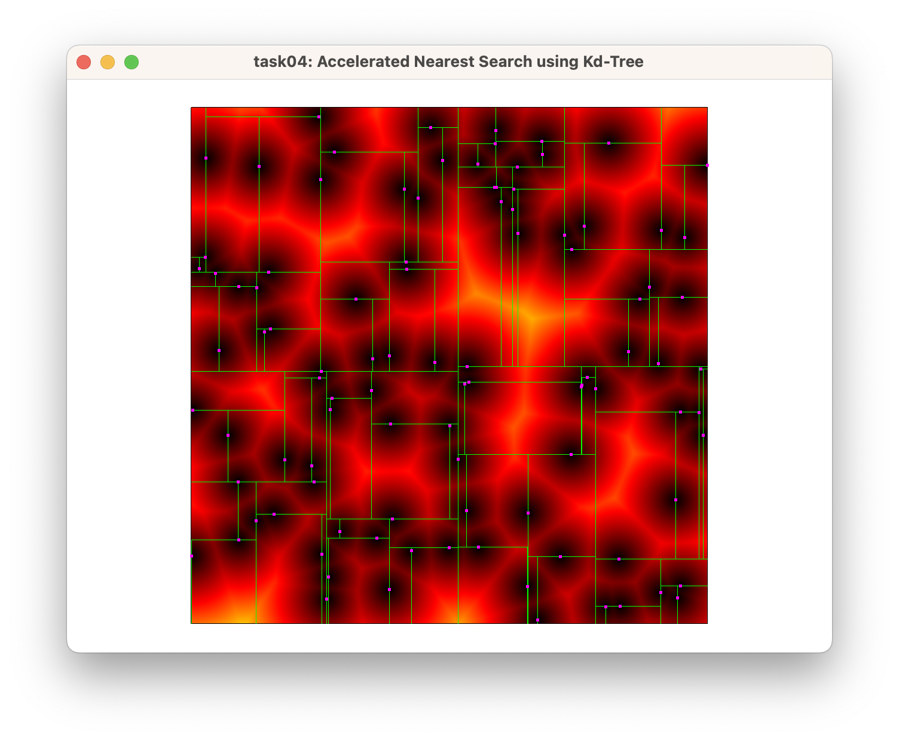

# Task04: Accelerated Nearest Search using Kd-Tree


**Deadline: May 18th (Thu) at 15:00pm**

----

## Before Doing Assignment

If you have not done the [task00](../task00), do it first to set up the C++ graphics development environment.

Follow [this document](../doc/submit.md) to submit the assignment, In a nutshell, before doing the assignment,

- install `eigen` library following  [this document](../doc/setup_eigen.md)
- make sure you synchronized the `main ` branch of your local repository  to that of remote repository.
- make sure you created branch `task04` from `main` branch.
- make sure you are currently in the `task04` branch (use `git branch -a` command).

Now you are ready to go!

---

## Problem 1

This program is computationally expensive. Build the program with ***Release*** mode to make the program run faster.  
Configure the project with 
```bash
cmake -DCMAKE_BUILD_TYPE=Release ..
```
instead of
```bash
cmake ..
```

If you are using ***Visual Studio*** on Windows, specify the release mode at ***build time*** as  

```bash
cmake --build . --config Release
```
instead of

```bash
cmake --build .
```


Then, run the code. Take a screenshot image. 
Save the screenshot image overwriting `task04/problem1.png`




This program computes distance field from random points.

Run the program with different numbers of the particles (5k, 10k, and 20k).
The number of the particle can be set at `line #208`  in [main.cpp](main.cpp).
Record the computation time by filling the table below.     

| #points | time |
| --- | --- |
| 5000 | 1092ms |
| 10000 | 2186ms |
| 20000 | 4187ms |


## Problem 2

The current code compute the distance in the brute-force way. 
If there is `N` number of points, the computational cost is `O(N)`.  
Let's accelerate the computation using the [Kd-tree data structure](https://en.wikipedia.org/wiki/K-d_tree).

Write a few lines of code around `line #115` to accelerate the search. 

Run the program with different numbers of the particles (5k, 10k, and 20k). 
Record the computation time by filling the table below.

| #points | time |
| --- | --- |
| 5000 | 85ms  |
| 10000 | 134ms |
| 20000 | 203ms |


## After Doing the Assignment

After modifying the code, push the code and submit a pull request.


## Notes

- Do not submit multiple pull requests. Only the first pull request is graded
- Do not close the pull request by yourself. The instructor will close the pull request
- If you mistakenly merge the pull request, it's OK, but be careful not to merge next time. 
